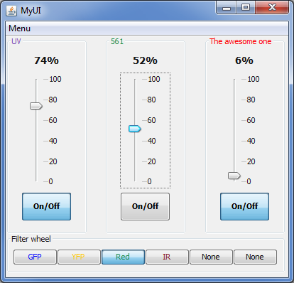
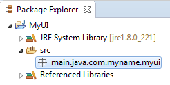
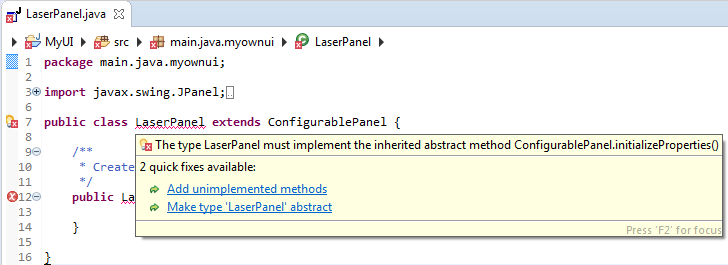
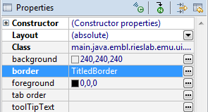
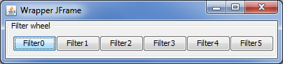
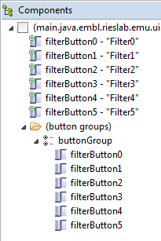
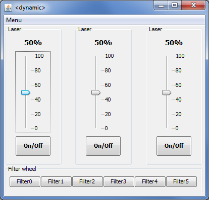
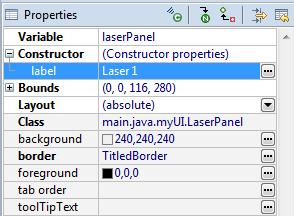

This tutorial is a simple example walk-through of how to build a plugin
for EMU, in order to obtain a re-configurable user interface within
Micro-Manager. We will put together a user interface to control three
lasers and one filterwheel using the drag and drop editor of Eclipse.

The tutorial requires a basic understanding of Java as some functions
need to be implemented. However here, the snippets of code are provided. At the end of the tutorial, few tips are given on what is
possible to do with EMU and where to find more in-depth explanations.

Here is a preview of the UI we are going to build:

<p align="center">

</p>

You will see that while working on the source code we will not write
down the name of the properties each button is supposed to change. We
will also not tell what are the colors or names of the lasers or
filters. All this will be configured through the EMU interface in
Micro-Manager.

The tutorial has been tested with the following versions:

Micro-manager: **2.0.0-gamma1 20181202**

Java: **jdk1.8.0\_201**

Eclipse: **Version: 2018-12 (4.10.0)**

EMU: commit hash **253268c**, commit tag **v1-alpha-release**

A - Making sure that eclipse runs java 8
====================================

1)  In Eclipse, go to "**Window -\> Preferences -\> Java -\> Installed
	JREs**" and make sure that java 1.8 or 8 is known. Otherwise, you
    will need to download it and link it to Eclipse (in the same
    window).

B - Downloading the WindowBuilder plugin for Eclipse 
=================================================

1)  WindowBuilder is an Eclipse plugin to build user interface by
    dragging and dropping the elements. To install the WindowBuilder and
    the Swing designer plugins, go to "**Help -\> Install New
    Software**". In the window that opens, in "**work with**", select "**All Available Sites**". Search for "*WindowBuilder*", check all
    the relevant packages (they should appear within "**General purpose tools**"). Then search for "*Swing Designer*" and again check the
    relevant packages. Finally install them.

2)  Restart Eclipse

C - Setting up the eclipse project
==============================

1)  First, we import the EMU project in eclipse (refer to the EMU
    guide). You will need to clone or download/unzip the EMU source code
    from Github (jdeschamps/EMU) and import it in Eclipse as a Maven
    project. This should fetch automatically some of the dependencies.
    Then you will have to add to the build path of the project the
    ij.jar (from Micro-manager2) and all jars contained in the mmplugin
    folder of Micro-Manager2-gamma.

2)  Then we will create our own project: in the "**Package Explorer**"
    window, right-click and create a new "**Java Project**"

<p align="center">

</p>


3)  On the pop-up, sets the name of your project. E.g. "*MyUI*". Make
    sure that **JavaSE-1.8** or equivalent (e.g. jdk1.8, JavaSE8) is
    selected on the "**JRE**" section. Click next.

4)  Select the "**Projects**" tab, click on "**Add...**" and select
    **EMU**. Then click finish.

5)  Right-click on the project, and create a new "**Package**". Name it
    something like "*main.java.myUI*". Make sure that the source is
    "*MyUI/src*". The package should appear in the ***src*** source
    folder in your project.
    
<p align="center">

</p>


D - A bit of background
===================

In Java Swing (a library for user interface), the main elements of a UI
are the Components (buttons, sliders, text fields...), the JPanels and
the JFrames. The components are positioned in JPanels and the JPanels
are assembled in a JFrame.

EMU uses modified versions of JPanels and JFrames: ConfigurablePanel and
ConfigurableMainFrame. The particularity of ConfigurablePanels is that
they declare UIProperties and UIParameters. UIProperties are intended to
be linked to a device property in Micro-Manager. That way, when the user
interacts with a ConfigurablePanel (e.g. clicking on a button), a
UIProperty can be modified and propagate the change to the device
property, in turn changing the state of one of your devices. The
principle of EMU is to automatically grab these properties and, through
an interface within Micro-Manager ("**Settings**" of the EMU window),
offer an intuitive way to map the device properties with the
UIProperties. That way, nothing about the actual devices on your
microscope is hard-coded in the user interface. The UI can then be used
on different microscopes without recompiling, and any change in devices
(new laser?) can be applied to the UI by simply changing the settings in
EMU.

UIProperties are a different mechanism, aimed at allowing the user to
change some aspects of the UI through the same interface within
Micro-Manager. This can for instance be text colors (for your lasers or
filters for instance), titles or default values for some parameters.

The coding needed to implement both ConfigurablePanel and
ConfigurableMainFrame is limited to:

-   Within a ConfigurablePanel: what are the components (buttons, text
    fields...etc...), how are they organized visually, what happens when
    the user interact with the components (which UIProperty is modified,
    if at all?) and what happens when the UIProperties are modified.

-   Within the ConfigurableMainFrame: which are the ConfigurablePanels
    and how are they organized.

The rest is performed automatically. By using visual editors for Swing,
most of the arranging can be done without writing a line of code,
although for complex endeavors it might require a good knowledge of how
the Swing library works. A lot of tutorials and information are
available online. Finally, the result of user interaction and impact of
a change in the value of a UIProperty have to be done programmatically.
In this example, we will see that, most of the time, this consists in
quite simple programming.

E - Creating the modules of your UI: ConfigurablePanels
===================================================

In this section, we will create two panels with several **components**
for the user to interact with. Usually in Swing, the alignment of the
components within each panel will be dictated by a **Layout**. Here for
simplicity, we will use the "**AbsoluteLayout**", which allows you to
place the components exactly where you want. Each component will have
**event handlers** corresponding to actions of the user (such as
clicking on a button or entering a text in a text field). We will then
add snippets of codes in the right methods to generate the
ConfigurablePanel **properties** and **parameters**, and their
interactions with the components.

1)  Right click on your package and select "**new -\> other**". In the
    pop-up, select "**WindowBuilder/Swing Designer/JPanel**". If
    WindowBuilder or Swing Designer does not appear, then refer to the
    section on installing these plugins for Eclipse. Click next and name
    the JPanel, e.g. "*LaserPanel*". In the "**superclass**" section,
    search for "**ConfigurablePanel**".

> **Note**: If ConfigurablePanel does not appear, then EMU has probably
> not been added to the "**Projects**" tab in C-4. Click on finish.
>
> **Note**: A JPanel is a Java container in which you can place
> components such as buttons or sliders. In EMU, the basic modules are
> ConfigurablePanels, which are extensions of JPanel. Therefore, in
> order to build an EMU plugin, we needed to change the nature of
> "*LaserPanel*" from JPanel to ConfigurablePanel.

The class should appear in the "**Package Explorer**" and its java code pop up.

2)  Eclipse should now point out errors in the code. Place the mouse on
    the underlined error in the declaration of the class: "**public**
    **class** [LaserPanel]{.underline} **extends** ConfigurablePanel".
    Eclipse should describe the error ("The type \[...\] must implement
    the inherited abstract method \[...\]") and offer solutions: click
    on "[Add unimplemented methods]{.underline}". A bunch of methods
    should now appear in the code.

<p align="center">

</p>


> Note: If Eclipse does not suggest anything when the mouse is placed on
> the error, then look at the preferences in "**Window/Preferences**" in
> the section "**Java/Editor/ContentAssist**".

3)  The constructor "**public** [LaserPanel()]{.underline}" should still
    contain an error. The reason is that while JPanel basic constructor
    does not have arguments, ConfigurablePanel constructors do. In
    between the parenthesis write "String label": "**public**
    [LaserPanel(String label)]{.underline}". Finally, in the body of the
    constructor, write "**super**(label);". The method should now look
    as following:

```java
public LaserPanel(String label) {
	super(label);
}
```

Save the class, the error warning should disappear. Your
ConfigurablePanel has now a name (but we don't know which one yet)!

4)  At the bottom of the window in which
    the Java code is displayed, click on "**Design**". This opens the
    graphical editor of Eclipse. You should see an empty grey rectangle
    that represents the ConfigurablePanel. In the following points, we
    are going to add components and define some actions for when the
    user interact with them. But first, let's define how the components
    will be arranged. Java offers different types of components layout:
    <https://docs.oracle.com/javase/tutorial/uiswing/layout/visual.html>.

    For this laser panel, let's choose a **AbsoluteLayout** for
    simplicity: select it and then apply it by clicking on the panel. In
    the "**Components**" window, select the ConfigurablePanel. The
    parameters appear should appear, with the line "**Layout** \|
    (absolute)".

<p align="center">


5)  With the ConfigurablePanel selected, in the "**Properties**" window,
    click on "..." in front of the "**Border**" property. A new window
    appears. Select "**Titled border**", and give it a name ("*Laser*")
    and a justification (e.g. "*Left*"). Then click ok.

<p align="center">

</p>


6)  Let's now place the first component: a **JLabel**. Select it and
    place it on the ConfigurablePanel, write "*50%*" in there. Its
    parameters appear, give it a name (e.g. Variable:
    "*laserPercentageLabel*"). Let's make it a bit prettier and, in the
    properties, click on "..." in the "**font**" property. Set it to
    "*14*" and "*bold*". Also set the "**horizontal alignment**" to
    "*center*". Click on "**Ok**".

7)  Next, add a **JSlider** below the laser percentage label in the
    ConfigurablePanel and name it ("*laserPercentageSlider*"). In the
    properties, select the "**VERTICAL**" **orientation**. You will have
    to resize it to make it taller than large. Now we want this
    component to set the laser percentage when the user moves the
    cursor. For this we need to add an **event handler**. Right click on
    the JSlider and add an "**Add** **event handler -\> mouse -\>
    mouseReleased**". You will be sent to the Java code. Let's ignore
    this for now. Click again on the "**Design**" tab. Let's make it a
    bit prettier as well. In the properties, enable "**paintLabels**"
    and "**paintTicks**". Verify that the minimum and maximum are 0 and
    100 (so that they correspond to percentages). Then set the
    "**majorTickSpacing**" to 20.

8)  Finally, add a **JToggleButton**, set its text to "*On/Off*" and
    name it "**laserOnOffButton**". Add an item event handler: "**Add**
    **event handler -\> item -\> itemStateChanged**".


9)  Resize the elements and the window so that it there is not too much
    blank space and all the elements fit. You can see how the panel
    looks by clicking on the following button:

<p align="center">    

</p>

    
   And this how the panel looks like:
<p align="center">

</p>


10) For each component, right click on it and select "**Expose
    component**". Set it to "**protected**" and click ok.

Now it is time to implement the body of the different methods in the
Java code that we ignored: the *ConfigurablePanel methods* and the
*event handlers*. The goal here will be to create the properties and
parameters of the ConfigurablePanel and their interactions with the
components.

11) Go to the "**Source**" tab.

12) Replace the "**[null]**" object returned by "**public**
    String getDescription()" by a description of what the panel is
    intended for, e.g.:
    
```java
@Override
public String getDescription() {
	return "Panel controlling the power percentage of a single laser.";
}
```

13) Let's create two properties: laser percentage and laser operation.
    The first one will be changed when the JSlider is moved, the second
    one when the JToggleButton is clicked. First, create global
    variables that cannot be changed to hold the name of the properties:

```java
public class LaserPanel extends ConfigurablePanel {
    //////// Properties
    public final static String LASER_PERCENTAGE = "power percentage";
    public final static String LASER_OPERATION = "enable";

    [...]
```

   This is not a necessary step, but using the constant
    "***LASER\_PERCENTAGE***" instead of "power percentage" every time
    we need to call the UIProperty will greatly reduce the chances of
    making a mistake.

14) In the method "**protected** **void** initializeProperties()",
    create the properties and add them to the ConfigurablePanel:


```java
@Override
protected void initializeProperties() {	

	// description of the LASER_PERCENTAGE property
	// (this will be displayed in the help window of EMU)
	String text1 = "Property changing the percentage of the laser.";

	// description of the LASER_OPERATION property
	String text2 = "Property turning the laser on and off.";

	// Adds a new property called LASER_PERCENTAGE:
	// new UIProperty(<ConfigurablePanel that created it>, <Name of the property>, <Description>, <FLag>)
	// Since we might have several lasers, we want the property to have a unique name,
	// therefore we use the label of the ConfigurablePanel in the name. The NoFlag call
	// is beyond the scope of this tutorial.
	addUIProperty(new UIProperty(this, getLabel() + " " + LASER_PERCENTAGE, text1, new NoFlag()));

	// Using <getLabel()+” ”+LASER_PERCENTAGE> here means that EVERY time we need to call the
	// UIProperty we should use the same expression!

	// We do the same with LASER_OPERATION, albeit with a different type of property.
	// Since on/off is only “on” or “off”, we ensure that this will always be the
	// case by making it a two-state property.
	addUIProperty(new TwoStateUIProperty(this, getLabel() + " " + LASER_OPERATION, text2, new NoFlag()));
}

```

Errors should arise. This time again, place the cursor on the
UIProperty, the TwoStateUIProperty and the NoFlag classes, then Eclipse
should subject to import the classes and the error will disappear.

15) Now that the properties have been declared in the right method,
    let's implement the effect of the components upon interaction with
    the user. Implements the body of the **mouseListener** that was
    applied to the JSlider as followed:

```java
laserPercentageSlider.addMouseListener(new MouseAdapter() {
	@Override
	public void mouseReleased(MouseEvent arg0) {
		// Retrieves the new value of the JSlider
		int val = laserPercentageSlider.getValue();
			
		// Sets the property to this value (remember to use the same name as in the
		// declaration)
		setUIPropertyValue(getLabel() + " " + LASER_PERCENTAGE, String.valueOf(val));

		// let's also modify the JLabel!
		laserPercentageLabel.setText(String.valueOf(val) + "%");
	}
});
```

The code to modify the property is pretty simple: when the user drags
the slider and let it go, the function "mouseReleased()" is called. In
its body, it just retrieves the new value of the JSlider and sets the
UIProperty to this value. Note that the value has to be passed as a
**String**. An important point is that the method "setUIPropertyValue()"
expects the name of the UIproperty: this should be the exact same name
that we set in 14). That is to say here:
"***getLabel()+' '+LASER\_PERCENTAGE***".

16) Let's do the same for the **JToggleButton**. Here we have an
    **itemListener**, and we just need to know if the button was
    selected or unselected. Implements the following body of "**public**
    **void** itemStateChanged(ItemEvent e)":

```java
laserOnOffButton.addItemListener(new ItemListener() {
	public void itemStateChanged(ItemEvent arg0) {
		if (arg0.getStateChange() == ItemEvent.SELECTED) { // if the JToggleButton was selected
			// sets the UIProperty to the On state (without any prior on what this
			// state is)
			// since we declared the UIProperty as a TwoStateUIProperty, we know
			// this will work out!
			setUIPropertyValue(getLabel() + " " + LASER_OPERATION, TwoStateUIProperty.getOnStateName());
		} else if (arg0.getStateChange() == ItemEvent.DESELECTED) {// if the JToggleButton was deselected	
			setUIPropertyValue(getLabel() + " " + LASER_OPERATION, TwoStateUIProperty.getOffStateName());
		}
	}
});
```

Here the UIProperty is a TwoStateUIproperty, and therefore it only
accepts two states. Because we do not know what this state is, we just
send the generic "TwoStateUIProperty.*getOnStateName*()" and
"TwoStateUIProperty.*getOffStateName*()". And this will work!

17) We have one last property-related method to implement:
    "**propertyHasChanged()**". This method is called when a property
    has been modified beyond the scope of this ConfigurablePanel. This
    is for instance the case at the initiation of EMU or when another
    ConfigurablePanel modifies the same device property. Let's have a
    look at an implementation:

```java
@Override
protected void propertyhasChanged(String propertyName, String newvalue) {
	if (propertyName.equals(getLabel() + " " + LASER_PERCENTAGE)) {
		if (utils.isNumeric(newvalue)) {
			// rounds it up
			int val = (int) Double.parseDouble(newvalue);

			if (val >= 0 && val < 100) {
				laserPercentageSlider.setValue(val);
				laserPercentageLabel.setText(String.valueOf(val) + "%");
			}
		}
	} else if (propertyName.equals(getLabel() + " " + LASER_OPERATION)) {

		// get the value of the On state of the LASER_OPERATION UIProperty 
		String onValue = ((TwoStateUIProperty) getUIProperty(getLabel() + " " + LASER_OPERATION)).getOnStateValue();

		if (newvalue.equals(onValue)) {
			laserOnOffButton.setSelected(true);
		} else {
			laserOnOffButton.setSelected(false);
		}
	}
}
```

Here, we first check which property has changed (by comparing
"**propertyName**" to the two properties name). If the property is
"LASER\_PERCENTAGE" (technically getLabel()+" "+ LASER\_PERCENTAGE),
then we check if it is a number, we round it (in case it has decimals)
and update both JLabel and JSlider. If it is "LASER\_OPERATION", and
since it is a TwoStateUIProperty which can only be in the on or off
state, we query the value of the on state (defined by the user at
run-time in the configuration) and compare it to the new value. Then we
update the JToggleButton depending on whether the value corresponds to
the on state or not.

18) It is time to have a look at parameters now. Parameters are aimed at
    updating an aspect of the ConfigurablePanel only once (during its
    initialization). This can for instance be the title of panel or the
    text color of a button. In our case, let's have both title and color
    of the titled border of the ConfigurablePanel. As in the case of the
    properties, we start by declaring some constants in the beginning of
    the class:

```java
//////// Parameters
public final static String PARAM_TITLE = "Name";
public final static String PARAM_COLOR = "Color";	
```

Then we implement the initialization method:

```java
@Override
protected void initializeParameters() {
	addUIParameter(new StringUIParameter(this, PARAM_TITLE, "Panel title.",getLabel()));
	addUIParameter(new ColorUIParameter(this, PARAM_COLOR, "Laser color.",Color.black));
}
```

Here, we create a String parameter for the title with a default value
which is simply the label of the ConfigurablePanel. We also create a
Color parameter initialized to black. You will have to import some
classes again to resolve the errors.

19) The next step is to implement the method called when the value of
    the parameter is changed:

```java
@Override
protected void parameterhasChanged(String parameterName) {
	if (parameterName.equals(PARAM_TITLE)) { // if title parameter
		// retrieves the TitledBorder and changes its title (that way our laser can be called anything in the UI!)
		((TitledBorder) this.getBorder()).setTitle(getStringUIParameterValue(PARAM_TITLE));
		this.repaint();
	} else if (parameterName.equals(PARAM_COLOR)) { // if color parameter
		// sets the color of the TitledBorder to make the laser more identifiable
		((TitledBorder) this.getBorder()).setTitleColor(getColorUIParameterValue(PARAM_COLOR));
		this.repaint();
	}
}
```

In this method, we again compare the label of the parameter that has
changed with our two parameters. Then we retrieve the border of the
ConfigurablePanel and cast it to **TitltedBorder** (which we know is the
type of Border we have here). Then we either update the title or the
title color, and finally we repaint the panel. That way we can have
several laser panel with different titles and colors. We do not add the
ConfigurablePanel's label to the name of the UIParameter as this is done
automatically.

We are now done with the LaserPanel!

20) In this example, we also implement another ConfigurablePanel for a
    filterwheel. Consult the source code to compare it to what we have
    just done.

    Here are roughly the different steps:

-   We create a new **ConfigurablePanel** with the **WindowBuilder**.

-   We set the layout to an **AbsoluteLayout**.

-   We add a **TitledBorder**.

-   We create six **JToggleButtons** arranged in a line. Give them a
    name related to their position. We advise starting the numbering
    from 0 for consistency with the UIProperty states we will work with.

<p align="center">

</p>

-   Right click on the first JToggleButton and select "**Set ButtonGroup
    -\> new standard**". A ButtonGroup will appear in the Components
    window. Then right-click the other buttons and set their
    **ButtonGroup** to the newly created buttonGroup (which should be
    called so). The ButtonGroup ensures that only one filter is selected
    at a time. The Components window should then look like the following image:
    
<p align="center">

</p>

-   We add an event handler under the form of an item listener to each
    JToggleButton.

-   We also expose the component (protected).

-   We add global variables for a UIProperty (filter wheel position) and
    for some UIParameters (name and colors of the filters). We also
    create a global variable with the number of filters (6).

-   We initialize a single UIProperty. This time it is of a new type, a
    MultiStateUIProperty. This type of UIProperty takes an additional
    number as parameter that defines the number of states is has. Here
    we use the global variable for the number of filters.

-   We then implement, for each button, the event handler. Here we
    simply check if the button is selected (since the effect of a
    **ButtonGroup** is to have only one button selected at a time),
    retrieve the value of the corresponding state of the UIProperty
    (**ATTENTION: here the numbering of the states start at 0**) and
    change the value of the UIProperty.

-   Then we implement the propertyHasChanged() method. There we retrieve
    the position of the state corresponding to the new value and set the
    selected state of the corresponding button to "true" (aka selected).

-   We then implement the initializeUIParameters with the declaration of
    the names and colors parameters.

-   We also added two private functions (see setNames and setColors) to
    take a comma separated string containing the names or the colors of
    the filters and to apply them to each button. These two functions
    are used in the parameterHasChanged() method.

-   Finally we implement the parameterHasChanged method.

F - Assembling the modules in the main window
=========================================

1) As in E-1, right-click on your package, and create a "new -\> other". Select a JFrame and in the pop-up window, give it a name ("MyFrame") and set its superclass to "ConfigurableMainFrame". Eclipse should show some error. First overlay the point on to the class declaration and ask Eclipse to automatically implement the missing methods. Finally, replace the constructor of the class by:

```java
public MyFrame(String title, SystemController controller) {
	super(title, controller);
}
```

Import the SystemController class (using Eclipse help). Now the only
error left should be in the call to "MyFrame frame = **new**
MyFrame();". There, replace "MyFrame()" by "MyFrame(\"\",**null**)".
This method will just be for testing purposes and will not be used in
Micro-Manager, so we can put a null value.

2)  In order to use our ConfigurablePanels graphically, we need to
    compile them. Right-click on your project and select "**Export**".
    Export your project as a **.jar**.

3)  In order to import your ConfigurablePanels in the WindowBuilder's
    palette, first go to **"Palette"** under the "**Design**". Then
    right click on the "**Custom**" category to go to "**Import
    Jar...**" and search your previously exported jar file. It will
    prompt you a list, you should then see FilterWheelPanel and
    LaserPanel. Checked them and click on "ok", they should then be
    added to the Palette.

4)  Add an **AbsoluteLayout** to the
    ConfigurableMainFrame content panel. Then place the components by
    clicking in the pallet on one of them and tracing in the
    ConfigurableMainFrame their position (and size). If the panel does
    not appear, you probably gave it a 0-by-0 size. Just select it and
    make it bigger just as you would do with a window on the computer.
    Arrange three lasers and the filter wheel panel. 

<p align="center">

</p>
An important step
    is to go the "Constructor" property of each of the ConfigurablePanel
    (in the properties window) and set the label to a unique name for
    each of them (remember this name is the label of each
    ConfigurablePanel, and will ultimately be in the name of the
    UIProperties and UIParameters, so make them unique!):
    
<p align="center">

</p>

5)  There is one last very important thing to do now, that is to move
    all the content of the constructor (except the "super()" call) to
    the "initComponents()" method.

```java
	public MyFrame( String title, SystemController controller) {
		super(title, controller);


	}

	@Override
	protected void initComponents() {
		setBounds(100, 100, 414, 398);
		getContentPane().setLayout(null);
		
		LaserPanel laserPanel = new LaserPanel("Laser 1");
		laserPanel.setBounds(0, 0, 116, 280);
		getContentPane().add(laserPanel);
		
		LaserPanel laserPanel_1 = new LaserPanel("Laser 2");
		laserPanel_1.setBounds(139, 0, 116, 280);
		getContentPane().add(laserPanel_1);
		
		FilterWheelPanel filterWheelPanel = new FilterWheelPanel("Filterwheel");
		filterWheelPanel.setBounds(0, 278, 395, 57);
		getContentPane().add(filterWheelPanel);
		
		LaserPanel laserPanel_2 = new LaserPanel("Laser 3");
		laserPanel_2.setBounds(279, 0, 116, 280);
		getContentPane().add(laserPanel_2);
	}
```

The reason to do so is to ensure that the frame is initiated at the
right moment. The WindowBuilder from Eclipse generates the code in the
constructor or in a method called by the constructor, but EMU expects
the code in the "initComponents()" method, which should NOT be called in
the constructor. **Another important point** is to remove the
"setDefaultCloseOperation(JFrame.***EXIT\_ON\_CLOSE***);" line,
otherwise upon closing your plugin Micro-manager will shut down.

G - Implementing the plugin class
=============================

1)  We need now to implement the plugin class. Right-click on the
    package and create a new class. In the window that pops up, indicate
    the name ("*MyPlugin*") and add an interface: **UIPlugin**. Click on
    finish.

2)  This class is very simple, you just need to indicate a name in one
    of the method and instantiate your main frame in the other:
    
```java
public class MyPlugin implements UIPlugin {

	@Override
	public String getName() {
		// TODO Auto-generated method stub
		return "MyUI";
	}

	@Override
	public ConfigurableMainFrame getMainFrame(SystemController controller) {
		// TODO Auto-generated method stub
		return new MyFrame(getName(), controller);
	}

}
```

H - Declaring the plugin and exporting the .jar
===========================================

1)  The final thing to do is to add a file that would tell EMU which
    class is the plugin class. Right click on your project and create a
    source folder called "*resources*". In this folder, create another
    folder (this time a normal one, not a source one) called
    "*META-INF*" and in META-INF a "*services*" folder. Finally, in
    resources/META-INF/services create a file called
    "*main.java.embl.rieslab.emu.plugin.UIPlugin*". In the file, just
    write "main.java.myUI.MyPlugin". Note that if you have different
    names you need to correct what is written in the file: here our
    package is "main.java.myUI" and our plugin class is called
    "MyPlugin".

2)  Now, right click on your project and select "**Export**". In the
    pop-up, select "**Java/JAR file**" and click on next. Choose the
    path of your Micro-manager gamma folder and export it to an EMU
    folder. E.g: "D:\\Program
    Files\\Micro-Manager-2.0gamma\\EMU\\MyUI.jar". Do not include in the
    .jar the previously created jar.

I - Loading in Micro-Manager and configuration
==========================================

1)  As a first step, make sure that "**EMU.jar**" is in the
    "**Micro-Manager-2.0gamma\\mmplugins**" folder. It should also
    appear in the Micro-Manager plugins menu in "**Plugins -\> Interface
    -\> EMU**".

2)  Start the plugin by clicking on it. If it is the first time you
    launch EMU, a pop-up should ask you which plugin to load. Select
    "MyUI" (or whatever name you gave).

3)  Another window appears, called "UI properties wizard". In this
    frame, you will see the UIProperties that we created for the
    LaserPanel and the FilterWheelPanel. If you see the mention "null"
    in the names, then you forgot to set the names of the panels in
    F.4). The TwoStateUIProperties and the MultiStateUIProperties have
    additional lines related to their states (TwoStateUIProperty has
    two, and our MultiStateUIProperty was set to six). In this menu, you
    can select for each UIProperty a device from Micro-Manager and the
    device property the UIProperty corresponds to: e.g. "Laser1 enable"
    to the device "iBeamSmart" and the property "Operation". Then you
    can enter the value of the states, e.g. for the
    "iBeamSmart-Operation" property in the property browser we see that
    it is either 1 (ON) or 0 (OFF). Therefore we set "Laser1 enable --
    On state" to "1" and "Laser1 enable -- Off state" to "0". Map all
    your devices, using the device property browser to guide you.

4)  The second tab on this window is for parameters. There you can
    select the names and colors of the lasers and filters, as we defined
    those to be parameters in our code.

5)  Save and try out your UI!

J - Going further
=============

Important steps that we followed:

-   Create new classes that extend "**ConfigurablePanel**". In these
    classes you can create "**UIParameter**" and "**UIProperty**". Each
    component you add to your panel (JButton, JTextField ...etc...) can
    have an event handler (called when the user interact with the
    component). In the event handler function, you can call
    "setUIpropertyValue" to modify the corresponding UIProperty.
    **Remember to use the exact name of the UIProperty.** Finally, the
    methods "propertyhasChanged" and "parameterhasChanged" are called
    whenever a UIParameter or a UIProperty have changed.

-   Export the project as a .jar to be able to use the
    ConfigurablePanels in the graphical designer.

-   Assemble the ConfigurablePanels within a
    "**ConfigurableMainFrame**". **Remember to give them a name and not
    let the "null" value in their declaration.**

-   Then we create the main class of your project: a class implementing
    "UIPlugin".

-   Once your UI is ready, you need to create within your project a file
    name "main.java.embl.rieslab.emu.plugin.UIPlugin". This file needs
    to be in the exact path:
    "src/resources/META-INF/services/main.java.embl.rieslab.emu.plugin.UIPlugin".
    In the file you should write the exact package and name of your main
    class, e.g. "main.java.myUI.MyUI". Any mistake here will cause EMU
    to fail to detect your UI.

-   Export the project as a .jar in the EMU folder in the root folder of
    Micro-Manager. You can open the .jar with any archive software (e.g.
    7zip) and check that "META-INF/services/
    main.java.embl.rieslab.emu.plugin.UIPlugin" is present in the
    packaged project.

In this tutorial, we only used a few of the possible types of parameters
and properties available in EMU. Here are some examples of what is
possible with the current version:

-   In the UI properties wizard, you can choose the name of your
    configuration. That way you can have several configurations in
    parallels. This is useful for instance if you have two of laser
    boxes and you want to switch from one configuration to the other.

-   You might have noticed in the code some methods we did not
    implement. Some of those are related to internal properties.
    Internal properties are used to share values between
    ConfigurablePanels. You just need to name them the same way and make
    sure they are of the same type in each of the concerned
    ConfigurablePanels, and they will automatically be joined by EMU.
    That way changing one from one panel, tells the other panel about
    the new value.

-   Several types of UIParameters exist: Boolean (e.g.: enable or not a
    button), Color (as used in the examples), Combo (a list of possible
    values for something), Double, Integer or String. UIProperties can
    be used to change something in the UI appearance as well as for
    default values of parameters (if you have a script for instance with
    two parameters).

-   The buttons and fields of your UI do not have to be linked to a
    UIProperty and can have other scopes: e.g. in our example, the
    percentage label.
